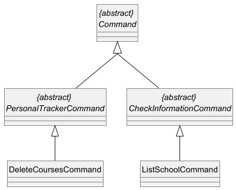
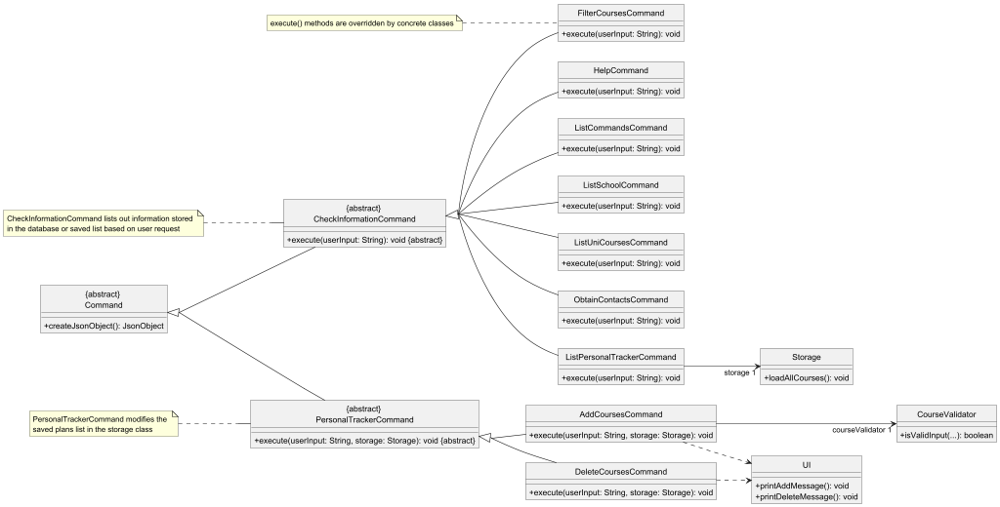
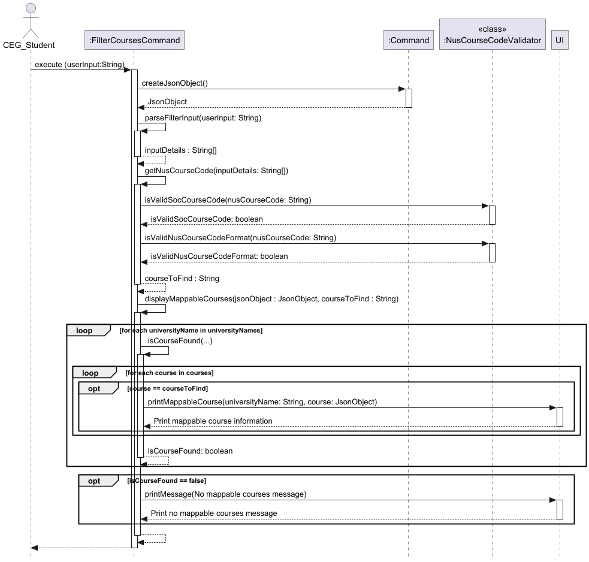
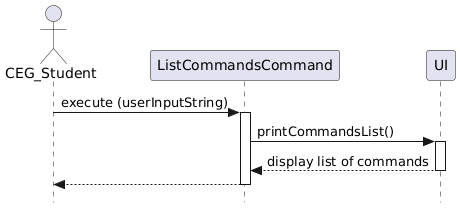
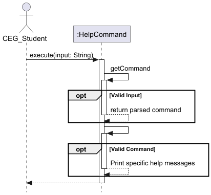
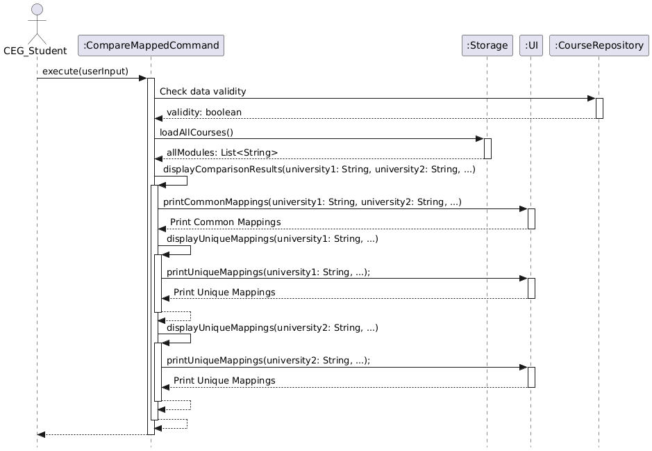

# Developer Guide

## Acknowledgements

### Database
* Adapted from NUS EduRec, data was collected manually as a collective effort from the team.

### Third Party Library Used

#### 'org.glassfish:javax.json:1.1.4'
* https://mvnrepository.com/artifact/org.glassfish/javax.json/1.1.4

#### 'javax.json:javax.json-api:1.1.4'
* https://mvnrepository.com/artifact/javax.json/javax.json-api/1.1.4

{list here sources of all reused/adapted ideas, code, documentation, and third-party libraries -- include links to the original source as well}
## Design

### Architecture


The **Architecture Diagram** given above explains the high-level design of the App.

Given below is a quick overview of main components and how they interact with each other.

**Main components of the architecture**

`ExchangeCourseMapper` class (referred to as `Main` in diagram) is responsible for the app launch and shut down.
* At app launch, it initializes the other components in the correct sequence, and connects them up with each other.
* At shut down, it shuts down the other components and invokes cleanup methods where necessary.

The bulk of the app’s work is done by the following four components:

`UI`: The UI of the App.

`Parser`: The command executor and logic checker.

`Command`: Details and implementation of various commands/features of the app.

`Storage`: Reads data from, and writes data to, `mylist.json`.

**How the architecture components interact with each other**

Only some of the commands will need all 4 main components for example the Delete course command:

The Sequence Diagram below shows how the components interact with each other for the scenario 
where the user issues the command `delete 1`.


The `UI`, `Parser` and `Storage` components (also shown in the diagram above),
* defines its API in a class with the same name as the Package

The `Command` component,
* defines its API in an `abstract` class with the same name as the Component.
* further splits them into `CheckInformationCommand` and `PersonalTrackerCommand` as child classes
* further split them into the various commands

For example, the `Command` component defines its API in the `Command.java` abstract class and extends its functionality using the 
`PersonalTrackerCommand.java` and `CheckInformationCommand` class. Other components such as `ListSchoolsCommand` and `DeleteCoursesCommand`  
interact with a given component through its interface rather than the concrete class 
(reason: to prevent outside component’s being coupled to the implementation of a component), as illustrated in the (partial) class diagram below.



**The sections below give more details of each component.**

### Class Diagrams
Command Package:


CourseValidator Class Diagram: 


{TODO: Object Diagram}

## Implementation

### 1. List Schools Command

#### Overview:
This command is responsible for displaying and retrieving the full list of universities
from `database.json` file. It helps the users to identify the possible choices in Oceania.

#### How the feature is implemented:
* The `ListSchoolCommand` class extends `Command` class where it overrides the `execute` method for
  custom behaviour.
* The command first reads a JSON file to obtain the names via `createJsonObject()` method from the
  superclass.
* The `displaySchoolList()` method will iterate over the keys of the database which contains the University
  names, upon acquiring the keys, they will be printed over the CLI.
* There are also assertions and logging in place for error handling.
* Line Separator is used to ensure readability and ease of use for users.

#### Sequence Diagram:


### 2. Filter Courses Command

#### Overview:
This command is responsible for displaying and retrieving the full list of mappable courses from the partner 
universities to a user specified NUS course from `database.json` file. It helps the users to identify whether
that NUS course is suitable to be mapped overseas in South East Asia and Oceania.

#### How the feature is implemented:
* The `FilterCoursesCommand` class extends `Command` class where it overrides the `execute` method for
  custom behaviour.
* The command first reads a JSON file to obtain the names via `createJsonObject()` method from the
  superclass.
* The `getNusCourseCode` method then extract out the user specified NUS course code from the input, which is in the
  format: `filter COURSE_CODE`.
* The NUS course code is then passed into the `displayMappableCourses()` method along with teh Json object. The method
  will iterate over the keys of the database which contains the University names, then obtain the array `courses`
  stored in the "courses" field. The `courses` array is then iterated over, for each course,
  if the value in the "nus_course_code" is equals to the NUS course code passed into the method, the university name and
  "pu_course_code" value of the course will be printed to the CLI.
* There are also assertions and logging in place for error handling.
* Line Separator is used to ensure readability and ease of use for users.

#### Sequence Diagram:


### 3. Obtain Partner University Email and Contact Number Command

#### Overview:
The command is responsible to retrieve the email contact and contact number data for a specified partner
university. It helps users to reach out to the partner universities for any enquiries about programs or
exchange opportunities.

#### How the feature is implemented:
* The `ObtainContactsCommand` class extends `Command` class where it overrides the `execute()` method for
  custom behaviour.
* The command first reads a JSON file to obtain the names via `createJsonObject()` method from the
  superclass.
* The `getSchoolName()` and `getContactType()` methods are used to parse the user input, extracting the requested 
  university name and contact type (email or phone number).
* After parsing, the `findMatchingSchool()` method identifies the correct university entry within the JSON data.
* The `handleContactType()` method retrieves and prints the requested contact information based on the input, 
  displaying either the university’s email address or phone number.
* There are also assertions and logging in place for error handling.

#### Why it is implemented that way:
* The `execute` method is essential and unique to every command class so inheritance was used.
* Every method in the class remains maintainable and has one responsibility this allows easy debugging and
  refactoring.
* By using inheritance, new command classes can easily extend the functionality of existing ones 
  which reducing redundancy in the code
* Logging and assertions helps the team of developers to follow through the command execution.

#### Alternatives considered:
* Reading of the `database.json` was tricky and other libraries were considered.
* Considered placing all the class methods inside the `execute` method but kept SLAP in mind to ensure
  readability.

#### Sequence Diagram:


### 4. List University Courses Command

#### Overview

This command is responsible for listing out all the mappable partner university’s (PU) courses and NUS courses. 
This allows users to plan their course mapping as it lists out all the possible courses they can map in a specified
partner university.

#### How the feature is implemented:
* The `ListUniCoursesCommand` class extends the `CheckInformationCommand` class where it overrides the execute method 
for custom behaviour.
* The command first reads a JSON file to obtain the JsonObject containing the names of all the partner universities.
* The getPuName method then parses and extracts the PU name from the input (with the format of `set [PU_NAME]`).
* Next, the extracted PU name is passed into the `getUniCourses()` method which will search for the specified PU in the
JsonObject with `findUniversityName()`.
* If the university is not found, an exception `UnknownUniversityException` will be thrown.
* If the PU is found, the `listCourses()` will be called. Then `getUniversityObject()` and `getCourseArray()` methods
will be called to get the JsonObject containing the PU and the JsonArray containing the list of courses it offers.
* The two object will be passed into `iterateCourses()` method to iterate through the JsonArray `courseArray` which
contains the list of courses.
* It then prints out the course details such as PU course code and NUS course code by calling the 
`printListUniCoursesCommand` method in the UI class.
* Assertions and logging are used for error handling.

#### Why it is implemented this why:
- ****Separation of Concerns:**** Each responsibility is seperated into smaller, well-defined methods
  For example, `getPuName()` focuses on extracting the university name from user input and `findUniversityName()`
  focuses on searching the university in the data set.

#### Sequence Diagram:


{Describe the design and implementation of the product. Use UML diagrams and short code snippets where applicable.}

### 5. Add Courses Command

#### Overview:
This command is responsible for adding users' desired course mapping into the `myList.json` file. 
Additionally, each course mapping is checked against the current course mapping found in the
`database.json` file, ensuring that the course mapping is accurate and is limited to Oceania 
and South-East Asian universities. This command hence helps the users to keep track of their course mapping process.

#### How the feature is implemented:
* The `AddCoursesCommand` class extends `Command` class where it overrides the `execute` method for
  custom behaviour.
* The command first reads a JSON file to obtain the names via `createJsonObject()` method from the
  superclass.
* The `trimString` method then removes the `add` command and checks whether the user gave any input after the command. 
  The method would return the user's input without the command.
* This input is then passed into the `parseAddCommand()` method to obtain the relevant information: NUS course code, 
  name of partner university and partner university course code.
* Along with the JSON Object created from the `createJSONObject()` method, the information extracted from the 
 `parseAddCommand()` method would be passed to the `isValidInput()` method to verify the user's course mapping.
* In the `isValidInput()` method, the `getPUCourseList()` method is called to verify the user's partner university is 
  included in the dataset. An exception is thrown if the university is not found in the dataset.
* Afterward, the `isValidCourseMapping` checks whether the NUS course code and PU course code are compatible for 
  course mapping. 
* If both checks above are passed, the course mapping would be added to the `myList.json` file.
* Throughout the code, exceptions, assertions and logging are in place for better error handling. 
* Line Separator is used to ensure readability and ease of use for users.

#### Sequence Diagram:


### 6. Delete Courses Command

#### Overview:
This command is responsible for deleting users' existing course mapping plan from the `myList.json` file.
This helps the users to keep track of their most recent course mapping plans, and to keep the `myList.json` file organised.

#### How the feature is implemented:
* The `DeleteCoursesCommand` class extends `Command` class where it overrides the `execute` method for
  custom behaviour.
* When `execute` is called, the command first passes the user's input into the `parseDeleteCommand` method, which parses
  the user input to extract the list index, still of `String` type, of the course mapping plan 
  they would like to delete.
* The parsed input is then passed into the `deleteCourse` method, along with the Storage object, which updates the
  `myList.json` file. The list index is then converted to an `int` using the `Integer` class. If a valid list index
  has been given by the user, the list index is passed into the storage object's `deleteCourse` method to delete the 
  plan stored at that index.
* Lastly, the UI object's `printDeleteMessage` is called to inform the user of the course plan which is deleted.
* Throughout the code, exceptions, assertions and logging are in place for better error handling.
* Line Separator is used to ensure readability and ease of use for users.

#### Sequence Diagram:


### 7. List Commands Command

#### Overview:
The `ListCommandsCommand` provides users with a comprehensive list of all available commands in the CLI. This is particularly useful for new users or those unfamiliar with specific command formats.

#### How the feature is implemented:
* The `ListCommandsCommand` class extends the `CheckInformationCommand` superclass and overrides the `execute` method.
* In the `execute` method, `printCommandList` from the UI class is called.
* A detailed list of commands with brief descriptions is printed to the CLI , providing users with command syntax and expected usage.
* The command list is formatted for readability with each command on a new line, and `LINE_SEPARATOR` is used before and after the list to create a visually distinct section in the CLI.
* Logging is implemented to track the start and completion of the command, facilitating debugging and traceability.

#### Why it is implemented that way:
* **Ease of Use**: Displaying all available commands in one place helps users quickly identify what actions are possible within the application.
* **Logging**: Logging the start and end of execution helps developers track usage patterns and troubleshoot issues if the command is not functioning as expected.

#### Alternatives considered:
* **Dynamic Command List**: Considered dynamically generating the command list from all command classes in the codebase to avoid manually updating this list, but opted for simplicity to prevent added complexity.
* **Help Command Integration**: Considered integrating `ListCommandsCommand` with the `HelpCommand` to provide a one-stop command for help-related requests, but separating them ensures clarity and keeps each command focused.

#### Sequence Diagram:


### 8. ListPersonalTrackerCommand

#### Overview:
The `ListPersonalTrackerCommand` is responsible for listing all the mapped modules stored in the user’s personal tracker. This command retrieves all stored courses from `myList.json` via the Storage class and displays them in an indexed list format on the CLI.

#### How the Feature is Implemented:
- The `ListPersonalTrackerCommand` class extends `CheckInformationCommand` and overrides the `execute` method to define custom behavior.
- **Constructor:** The constructor accepts a `Storage` object to access stored course mappings.
- **Execution Flow in `execute` Method:**
  - Calls `loadAllCourses` from the Storage class to retrieve the list of mapped modules.
  - If the list is empty, a message is displayed to inform the user that no modules have been mapped.
  - If there are mapped modules, it logs that modules will be displayed and then:
    - Prints a header and a line separator.
    - Iterates through `mappedModules`, printing each course with an index for readability by calling `printMappedModules` from the IU class.
    - Prints a closing line separator.

#### Why It Is Implemented This Way:
- **Single Responsibility:** This command is focused on a single responsibility—displaying the list of mapped modules—making it easy to maintain and test.
- **User-Friendly Output:** By indexing the output and adding line separators, the command ensures a clean and readable output format for users.

#### Alternative Implementations Considered:
- **Direct Output from Storage:** An alternative could have been to let the Storage class directly output the list. However, separating the command logic maintains a cleaner architecture and allows more flexibility in how the data is displayed.
- **Skipping Indexing:** Displaying the list without indexing was considered, but indexing improves readability, especially if the list of modules is long.

#### Example Usage and Expected Output:
If the `myList.json` file contains the following entries:

```
CS3244 | The Australian National University | COMP3670
CS2105 | The University of Western Australia | CITS3002
CS2102 | The University of Melbourne | INFO20003
```

Running the `ListPersonalTrackerCommand` would output:

```
Mapped Modules:
-----------------------------------------------------
1. CS3244 | The Australian National University | COMP3670
2. CS2105 | The University of Western Australia | CITS3002
3. CS2102 | The University of Melbourne | INFO20003
-----------------------------------------------------
```

#### Sequence Diagram:


### 9. Help Command

#### Overview
This command provides users with detailed explanations of each feature and the ways to use them.
This allows users to navigate this program easily and effectively.

#### How the feature is implemented:
* The `ListUniCoursesCommand` class extends the `CheckInformationCommand` class where it overrides
  the execute method for custom behaviour.
* First, the user input is passed into the `getCommand()` method which extracts and processes the
  command. It does so by using `switch` statements to determine if the input matches one of the valid commands.
* If it does, it returns the command, if it does not, an `IllegalArgumentException` exception will be thrown to handle
  invalid commands
* Then, the `printHelp()` method will be called to display the detailed help messages for the specific command.
  Another `switch` statement is used here to map each command to its corresponding help message.
* Assertions and logging are implemented for error handling.

#### Why it is implemented that way:
- ****Separation of Concerns:**** Each method has a single responsibility. For example, `getCommand()` parses and
  validates the input to extract a specific command and `printHelp()` prints the relevant help message for the
  parsed command.
- ****Switch Statement:**** The use of `switch` statement is an efficient way to match valid commands.
  `switch` statements are also clearer and easier to read.

#### Alternative Implementation considered:
- The use of `if-else` statement
  - However, since the condition is a single variable and not complex conditions, it will be cleaner and clearer to use
  `switch` statements

#### Sequence Diagram:
- Represents when `execute()` method is called
  

### 10. Compare Mapped Command

#### Overview
The `CompareMappedCommand` is responsible for comparing course mappings between two specified partner universities. 
This command aids users in identifying common course mappings across the selected universities, as well as highlighting 
unique course mappings specific to each university.

#### How the Feature is Implemented
The `CompareMappedCommand` class extends `CheckInformationCommand` and overrides the `execute` method to define its custom behavior. Below is an outline of the execution flow:

**Parsing User Input**:
  - The command splits the user input based on the delimiter `pu/` to retrieve the names of the two universities specified by the user.
    - If fewer than two universities are specified, the `printInvalidInputFormat` method in the `UI` class is called to inform the user of incorrect input format.

**Loading Data and Initial Checks**:
  - The command loads all course mappings from the `myList.json` file through the `Storage` class.
  - It verifies that the loaded list is not `null` through assertions.

**Filtering Modules by University**:
  - The `filterModulesByUniversity` method takes the list of all modules and filters out only those associated with the specified university.
  - Logging is used to track this filtering process.

**Extracting Course Codes**:
  - The `extractCourseCodes` method extracts the unique course codes for each university, enabling the subsequent comparison.

**Identifying Common and Unique Course Codes**:
  - The `getCommonCourseCodes` method calculates the intersection of course codes between the two universities, identifying courses available in both.
  - The `getUniqueCourseCodes` method identifies unique courses by excluding the common course codes for each university.

**Displaying Results**:
  - The `displayComparisonResults` method provides output for the comparison:
    - Common mappings are displayed first, showing courses available in both universities.
    - Unique mappings are shown next, detailing courses specific to each university.
  - The output format is controlled through methods in the `UI` class for better readability and user experience.

#### Why it is Implemented this Way
- **Separation of Concerns**: Methods are organized by function, with each handling a specific part of the comparison logic. This promotes code readability and maintainability.


#### Alternatives Considered
- **Combined Filtering and Extraction**: Initially, filtering and course code extraction were considered for a single method, but separating them simplified the debugging process and enhanced the code structure.
- **Display Inline in `execute`**: Displaying results directly in the `execute` method was an option. However, using dedicated methods (e.g., `displayComparisonResults`) improved readability and made testing individual components easier.

#### Sequence Diagram:


## Product scope
### Target user profile

* CEG students keen to go for SEP and need a clear and organised UI to see course mappings
* CEG students who want to plan their schools and courses to take 

### Value proposition

* CEG students can use ExchangeCourseMapper to expedite their for course mapping process by listing universities 
  and specific courses with their subject codes
* CEG students can easily filter by either NUS-coded modules or partner universities (PU) to quickly identify relevant course options.
* CEG students can easily load and save the saved courses in a data file for safekeeping
* The CLI interface provides an efficient experience for users focused on planning their SEP with precision.

## User Stories

| Version | As a ...    | I want to ...                                           | So that I can ...                                              |
|---------|-------------|---------------------------------------------------------|----------------------------------------------------------------|
| v1.0    | CEG student | see the possible Oceania Universities for CEG students  | see all my possible choices in those regions                   |
| v1.0    | CEG student | search for NUS courses to map                           | search for related courses in PUs                              |
| v1.0    | CEG student | key in the school I want to go for exchange             | view the available course offered by the school                |
| v1.0    | CEG student | want to see a list of commands                          | know what to do to go to access the features                   |
| v2.0    | CEG student | obtain the email address of the partner universities    | send an email should I have any queries                        |
| v2.0    | CEG student | obtain the contact number of the partner universities   | call the number should I have any urgent queries               |
| v2.0    | CEG student | add a course mapping plan for a PU                      | keep track of my courses for a specific PU                     |
| v2.0    | CEG student | list out the mapped courses by calling the list command | I can track all the courses I have mapped to the different PUs |
| v2.0    | CEG student | delete a course mapping plan for a PU                   | keep my list of saved plans organised                          |
| v2.0    | CEG student | ask for help when I am in doubt                         | know what are the possible actions                             |
| v2.0    | CEG student  | compare different mapping plans for each PU                     | find the university best fit for my academic schedule    |


## Non-Functional Requirements

1. Access to a computer with Java 17 installed and an IDE that supports Java programming
2. A CEG Student in NUS planning to map out mainly BT/IS/EE/CS/CG-coded courses
{TODO: Add more} 

## Glossary

* *glossary item* - Definition

## Instructions for manual testing

{Give instructions on how to do a manual product testing e.g., how to load sample data to be used for testing}
