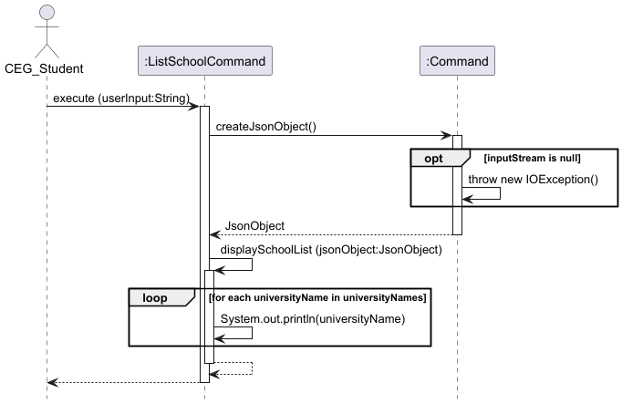
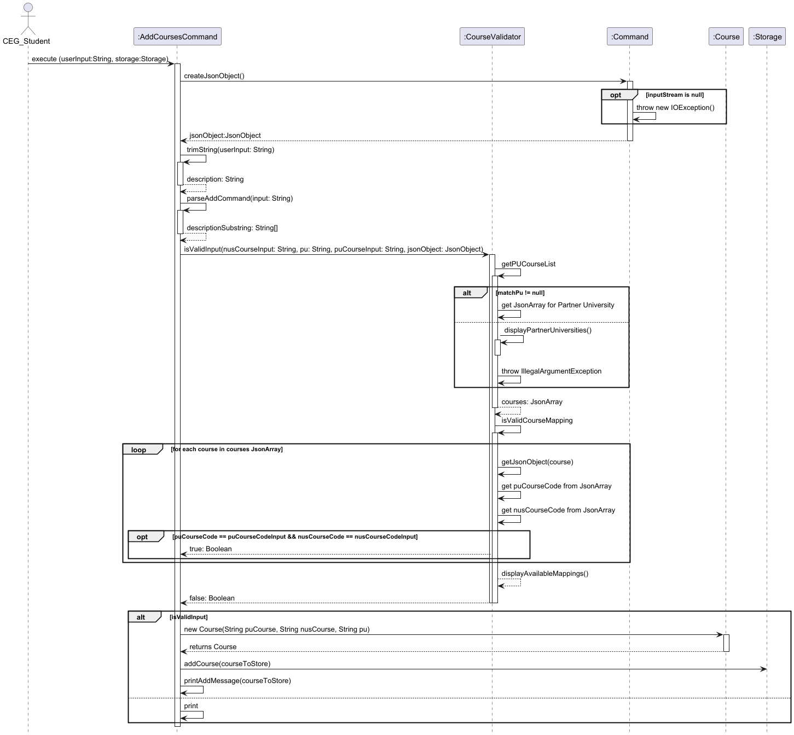

# Developer Guide

## Acknowledgements

### Database
* Adapted from NUS EduRec, data was collected manually as a collective effort from the team.

### Third Party Library Used

#### 'org.glassfish:javax.json:1.1.4'
* https://mvnrepository.com/artifact/org.glassfish/javax.json/1.1.4

#### 'javax.json:javax.json-api:1.1.4'
* https://mvnrepository.com/artifact/javax.json/javax.json-api/1.1.4

{list here sources of all reused/adapted ideas, code, documentation, and third-party libraries -- include links to the original source as well}
## Design

### Architecture
{TODO: Architecture Diagram}

### Class Diagrams
{TODO: Class Diagram}
{TODO: Object Diagram}

## Implementation

### 1. List Schools Command

#### Overview:
This command is responsible for displaying and retrieving the full list of universities
from `database.json` file. It helps the users to identify the possible choices in South East Asia
and Oceania.

#### How the feature is implemented:
* The `ListSchoolCommand` class extends `Command` class where it overrides the `execute` method for
  custom behaviour.
* The command first reads a JSON file to obtain the names via `createJsonObject()` method from the
  superclass.
* The `displaySchoolList()` method will iterate over the keys of the database which contains the University
  names, upon acquiring the keys, they will be printed over the CLI.
* There are also assertions and logging in place for error handling.
* Line Separator is used to ensure readability and ease of use for users.  

#### Why it is implemented that way:
* The `execute` method is essential and unique to every command class so inheritance was used. 
* Every method in the class remains maintainable and has one responsibility this allows easy debugging and
  refactoring.
* By using inheritance, new command classes can easily extend the functionality of existing ones
  which reducing redundancy in the code
* Logging and assertions helps the team of developers to follow through the command execution.

#### Alternatives considered:
* Reading of the `database.json` was tricky and other libraries were considered.
* Considered placing all the class methods inside the `execute` method but kept SLAP in mind to ensure 
  readability.

#### Sequence Diagram on PlantUML:

### 2. Filter Courses Command

#### Overview:
This command is responsible for displaying and retrieving the full list of mappable courses from the partner 
universities to a user specified NUS course from `database.json` file. It helps the users to identify whether
that NUS course is suitable to be mapped overseas in South East Asia and Oceania.

#### How the feature is implemented:
* The `FilterCoursesCommand` class extends `Command` class where it overrides the `execute` method for
  custom behaviour.
* The command first reads a JSON file to obtain the names via `createJsonObject()` method from the
  superclass.
* The `getNusCourseCode` method then extract out the user specified NUS course code from the input, which is in the
  format: `filter COURSE_CODE`.
* The NUS course code is then passed into the `displayMappableCourses()` method along with teh Json object. The method
  will iterate over the keys of the database which contains the University names, then obtain the array `courses`
  stored in the "courses" field. The `courses` array is then iterated over, for each course,
  if the value in the "nus_course_code" is equals to the NUS course code passed into the method, the university name and
  "pu_course_code" value of the course will be printed to the CLI.
* There are also assertions and logging in place for error handling.
* Line Separator is used to ensure readability and ease of use for users.

#### Sequence Diagram on PlantUML:

### 3. Obtain Partner University Email and Contact Number Command

#### Overview:
The command is responsible to retrieve the email contact and contact number data for a specified partner
university. It helps users to reach out to the partner universities for any enquiries about programs or
exchange opportunities.

#### How the feature is implemented:
* The `ObtainContactsCommand` class extends `Command` class where it overrides the `execute()` method for
  custom behaviour.
* The command first reads a JSON file to obtain the names via `createJsonObject()` method from the
  superclass.
* The `getSchoolName()` and `getContactType()` methods are used to parse the user input, extracting the requested 
  university name and contact type (email or phone number).
* After parsing, the `findMatchingSchool()` method identifies the correct university entry within the JSON data.
* The `handleContactType()` method retrieves and prints the requested contact information based on the input, 
  displaying either the university’s email address or phone number.
* There are also assertions and logging in place for error handling.

#### Why it is implemented that way:
* The `execute` method is essential and unique to every command class so inheritance was used.
* Every method in the class remains maintainable and has one responsibility this allows easy debugging and
  refactoring.
* By using inheritance, new command classes can easily extend the functionality of existing ones 
  which reducing redundancy in the code
* Logging and assertions helps the team of developers to follow through the command execution.

#### Alternatives considered:
* Reading of the `database.json` was tricky and other libraries were considered.
* Considered placing all the class methods inside the `execute` method but kept SLAP in mind to ensure
  readability.

#### Sequence Diagram on PlantUML:

{Describe the design and implementation of the product. Use UML diagrams and short code snippets where applicable.}

### 4. Add Courses Command

#### Overview:
This command is responsible for adding users' desired course mapping into the `myList.json` file. 
Additionally, each course mapping is checked against the current course mapping found in the
`database.json` file, ensuring that the course mapping is accurate and is limited to Oceania 
and South-East Asian universities. This command hence helps the users to keep track of their course mapping process.

#### How the feature is implemented:
* The `AddCoursesCommand` class extends `Command` class where it overrides the `execute` method for
  custom behaviour.
* The command first reads a JSON file to obtain the names via `createJsonObject()` method from the
  superclass.
* The `trimString` method then removes the `add` command and checks whether the user gave any input after the command. 
  The method would return the user's input without the command.
* This input is then passed into the `parseAddCommand()` method to obtain the relevant information: NUS course code, 
  name of partner university and partner university course code.
* Along with the JSON Object created from the `createJSONObject()` method, the information extracted from the 
 `parseAddCommand()` method would be passed to the `isValidInput()` method to verify the user's course mapping.
* In the `isValidInput()` method, the `getPUCourseList()` method is called to verify the user's partner university is 
  included in the dataset. An exception is thrown if the university is not found in the dataset.
* Afterward, the `isValidCourseMapping` checks whether the NUS course code and PU course code are compatible for 
  course mapping. 
* If both checks above are passed, the course mapping would be added to the `myList.json` file.
* Throughout the code, exceptions, assertions and logging are in place for better error handling. 
* Line Separator is used to ensure readability and ease of use for users.

#### Sequence Diagram on PlantUML

## Product scope
### Target user profile

* CEG students keen to go for SEP and need a clear and organised UI to see course mappings
* CEG students who want to plan their schools and courses to take 

### Value proposition

* CEG students can use ExchangeCourseMapper to expedite their for course mapping process by listing universities 
  and specific courses with their subject codes
* CEG students can easily filter by either NUS-coded modules or partner universities (PU) to quickly identify relevant course options.
* CEG students can easily load and save the saved courses in a data file for safekeeping
* The CLI interface provides an efficient experience for users focused on planning their SEP with precision.

## User Stories

| Version | As a ...     | I want to ...                                                   | So that I can ...                                |
|---------|--------------|-----------------------------------------------------------------|--------------------------------------------------|
| v1.0    | CEG students | see the possible Oceania and South East Asia partner university | see all my possible choices in those regions     |
| v1.0    | CEG student  | search for NUS courses to map                                   | search for related courses in PUs                |
| v2.0    | CEG student  | obtain the email address of the partner universities            | send an email should I have any queries          |
| v2.0    | CEG student  | obtain the contact number of the partner universities           | call the number should I have any urgent queries |
| v2.0    | CEG student  | add a course mapping plan for a PU                              | keep track of my courses for a specific PU       |

## Non-Functional Requirements

1. Access to a computer with Java 17 installed and an IDE that supports Java programming
2. A CEG Student in NUS planning to map out mainly BT/IS/EE/CS/CG-coded courses
{TODO: Add more} 

## Glossary

* *glossary item* - Definition

## Instructions for manual testing

{Give instructions on how to do a manual product testing e.g., how to load sample data to be used for testing}
